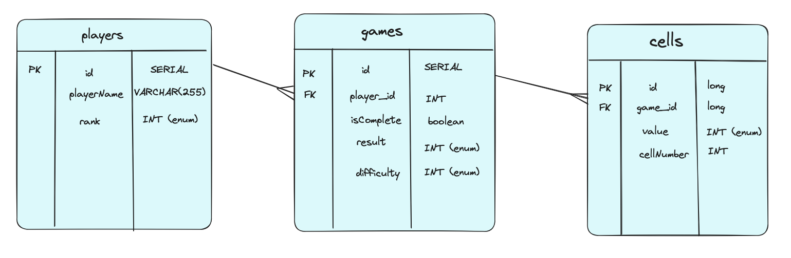
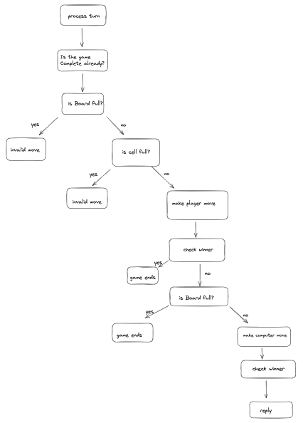

# Tic-tac-toe Game Project

## Aim ##

MVP

Create an interactive game of tic-tac-toe which can be played through postman. A player can be created with a name, and id. A game is made with a set of 9 blank cells, which can be filled through patch requests to the game. After a move is made, there is a computer response where a the computer takes a turn based on the player's move.

Game logic is implemented to process every possible outcome of the game and return the state of the game after each guess or after the game is complete.

Extension

- Create a leaderboard system where players gain and lose points for winning / losing games
- Create a ranking system where there are different ranks based on how many points a player has
- Add in a hard mode where the computer returns a move based on the current boardstate instead of being completely random
- Create a 2-player mode where two players can play against each other instead of against a computer

## Database structure ##

Database contains three linked tables (players, games, cells). One player can have many games and one game contains many cells.

# Packages - (components, controllers, models, repositories, services) (+ application runner) #

## components - data loader ##

data loader - on start up, a player(Zsolt) and a new game associated with that player are created

## Contollers - (GameController, PlayerController) ##
GameController - (all object returned are response entities containing relevent information)
- **@GetMapping** - getAllGames - return all the Games stored
- **@GetMapping** - getGameById - Show specific Game by ID
- **@GetMapping** - getGameState - Show specific Game information without excess unncessary information
- **@PostMapping** - startNewGame - creates a new blank game
- **@DeleteMapping** - deleteGameById - deletes a game by id
- **@PatchMapping** - updateGame - player has a turn, and then the computer makes a move if possible

PlayerController
- **@GetMapping** - getAllPlayers - show all Players
- **@GetMapping** - getPlayerById - show Specific Player by ID
- **@GetMapping** - getLeaderboard - shows list of players ordered by points descending
- **@PostMapping** - addPlayer - create a new Player
- **@DeleteMapping** - deletePlayerById - delete a player
- **@PatchMapping** - updatePlayerName - Update player's name but keeps player id

## Example payloads - (GameController, PlayerController) ##

GameController - (all object returned are response entities containing relevent information)
- **@GetMapping** - /games
- **@GetMapping** - /games/{id}
- **@GetMapping** - /games/game-state/{id}
- **@PostMapping** - /games 
	- JSON = {"difficulty": "{EASY or HARD}", "playerId": "{id}"}
	- difficulty can be EASY or HARD
- **@DeleteMapping** - /games/{id}
- **@PatchMapping** - /games/{id}
  - JSON = {"position": "{int 1-9}"}
  - position is a cellNumber in a game (1-9)

PlayerController
- **@GetMapping** - /players
- **@GetMapping** - /players/{id}
- **@GetMapping** - /players/leaderboard
- **@PostMapping** - /players
  - JSON = {"playerName":"Tom"}
- **@DeleteMapping** - /players/{id}
- **@PatchMapping** - /players/{id}
  - JSON = newPlayerName
  - This route takes in a string with the new player name

## UML Diagrams ##

## models - (BoardStateGameDTO, Cell, Game, GameDTO, Player, NewGameDTO, LeaderBoardDTO, ReplyDTO, Result, Value, Difficulty, Rank) ## 

BoardStateDTO (long id, Player player, boolean isComplete, Result result, List<List<Value<ignore>>> board)

Cell (long id, Game game, Value value, int cellNumber)

Game (long id, Player player, boolean isComplete, Result result, Difficulty difficulty, List<Cell<ignore>>)

GameDTO (int position)

LeaderBoardDTO (List<Player<ignore>>)

NewGameDTO (Difficulty difficulty, long playerId)

Player (long id, String playerName, List<Game<ignore>> games, Rank rank, long points)

ReplyDTO (String message, List<List<Value<ignore>>> board, boolean isValidMove, Result result)

(When enums are given in JSON, they must be provided in caps)

enum Rank (NOVICE_NOUGHT_NINJA, CROSSWORD_CRUSADER, TIC_TAC_TITAN, ZSOLT, ROCKSTAR)

enum Result (WIN, DRAW, LOSS)

enum Value (EMPTY, X, O)

enum Difficulty (EASY, HARD)

repositories - (CellRepository, GameRepository, PlayerRepository)

## Services - (GameService, PlayerService) ##

Gameservice

- getAllGames(return list of all games)
- getGameById(return an optional game)
- makeCells(when a new game is made, a set of 9 cells is created and saved to that game)
- startNewGame(return a new blank game with 9 cells associated to it)
- deleteGameById(remove game and associated cells from database)
- isCellFull(returns true if cell has and 'X' or 'O' in it)
- isBoardFull(returns true if every cell has and 'X' or 'O' in it)
- makePlayerMove(puts an 'X' in cell chosen by player)
- makeComputerMove(puts an 'O' in a random unoccupied cell)
- checkTwoinARow(returns the third cell in the row if user or computer has 2 in a row within each potential winning combination)
- reactiveMoveComputer(returns a list of potential moves for the computer to make to set up a two-in-a-row after taking in a list of cells where the computer has made one move in the row )
- makeComputerMoveHard(completes computer's move based on which conditions are met)
- isListWithCell(checks if the list it takes contains at least one cell)
- getValidCells(returns a list of the valid cells within a list passed in)
- getCellCombinations(return a List of the lists of all possible cell combinations that would give a 3 in a row)
- checkLine(return true if there is a line of 'X's or 'O's)
- checkWinner(return true if any possible checkLine is true)
- getGameState(returns a list of all the game's cells as a 2D array as it would appear in a 3x3 grid)
- processTurn(implements all the game logic for processing a turn, making processing computer turn and checking for winners, then returns a replyDTO (See flowchart above for logic))

PlayerService

- getAllPlayers(return a list of all players)
- getPlayerById(return Optional<Player<ignore>> by id)
- addPlayer(return new player added to database)
- deleteById(remove player from database)
- updatePlayerName(returns updated player and updates them in database)
